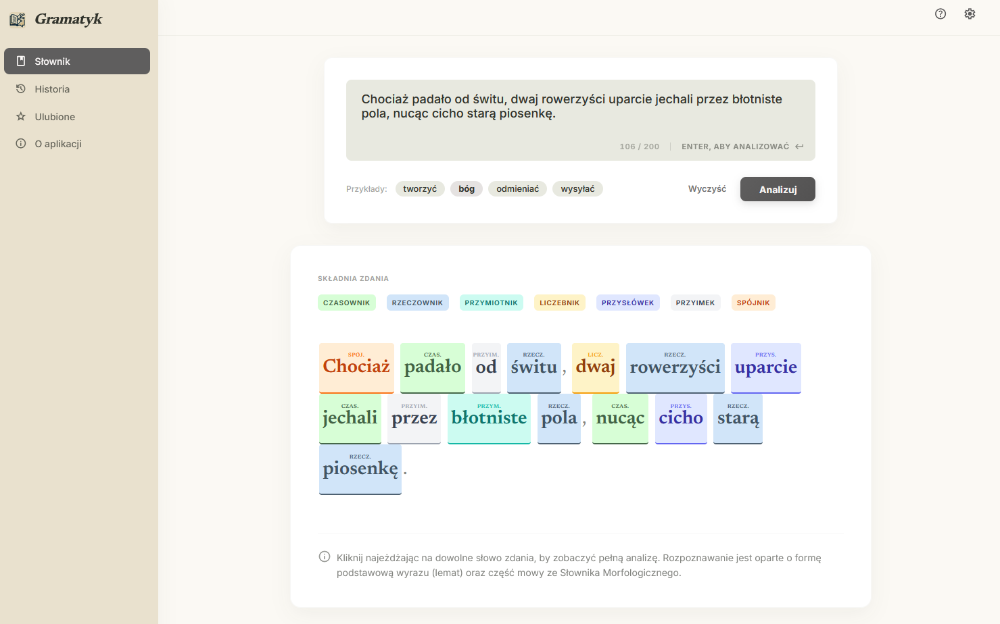
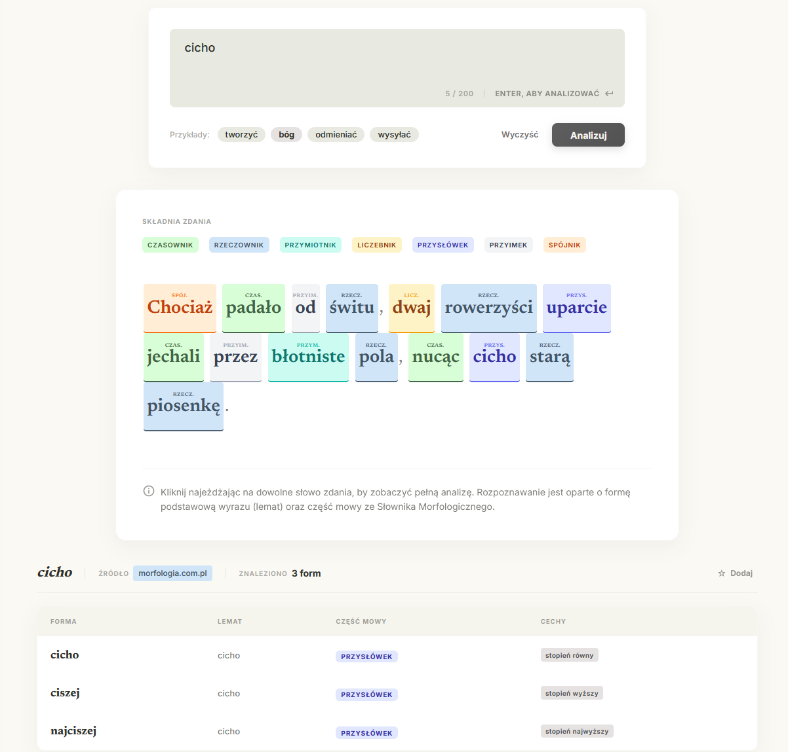
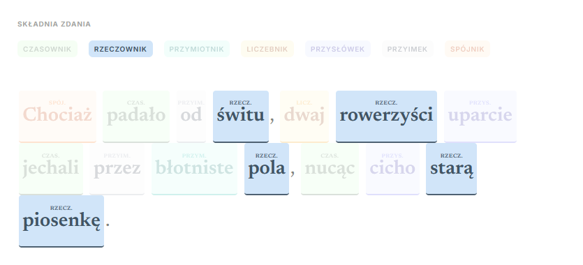
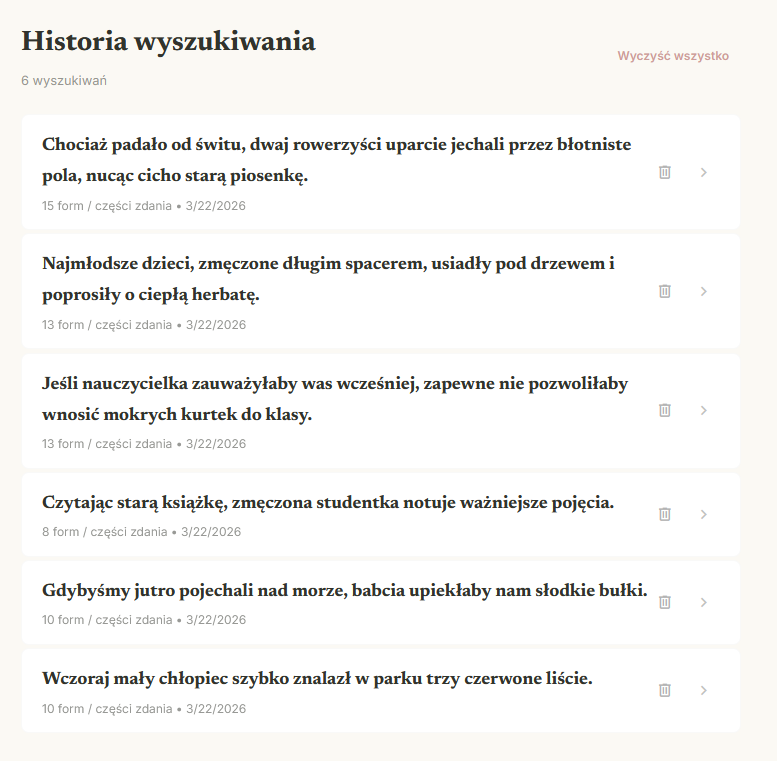

# Gramatyk

**Gramatyk** to aplikacja internetowa służąca do błyskawicznej i głębokiej analizy morfologicznej słów i zdań w języku polskim. W zgrabny sposób pobiera dane bezpośrednio ze słowników morfologicznych oraz SJP, zręcznie omijając ograniczenia odpytywanych serwerów za pomocą wbudowanego proxy, po czym prezentuje je w niezwykle czytelnym i wciągającym formacie.

Działa na żywo: **[https://gramatyk.vercel.app/](https://gramatyk.vercel.app/)**

## Przegląd Aplikacji

---

## Funkcjonalności i Działanie

### 1. Analiza Składni Całych Zdań
Aplikacja potrafi w locie analizować całe, długie i złożone zdania. Rozbija je na poszczególne słowa, rozpoznając część mowy i dokładną formę dla każdego wyrazu osobno. Otrzymujesz podgląd całego zdania z precyzyjnie pokolorowanymi etykietkami – czasowniki, rzeczowniki, przymiotniki czy partykuły oddzielone są unikatowymi, wibrującymi kolorami dla maksymalnej przejrzystości od pierwszego rzutu okiem.

*Podgląd w akcji: ``*

### 2. Interaktywna Legenda i Etykietowanie
Pod widokiem analizy zdania generowana jest interaktywna legenda podsumowująca gramatykę wpisanego przez Ciebie tekstu. Najechanie na jakikolwiek konkretny element (np. na ikonę "Rzeczownik") sprawia, że wszystkie rzeczowniki w wierszu zostają momentalnie wyraźnie wyciągnięte na wierzch, podczas gdy reszta tekstu gaśnie. Stanowi to potężne narzędzie dydaktyczne, w szczególności dla wzrokowców. 

*Podgląd w akcji: ``*

### 3. Analiza Pojedynczych Słów (Słownik)
Wpisz w okno dowolny polski wyraz, a aplikacja natychmiast rozpozna jego część mowy, rzuci formę podstawową (lemat) na stół i w ułamku sekundy zaprezentuje tabele wszystkich możliwych form odmiany słowa. Przejrzyste, pastelowe kapsułki opisują rodzaj ujęcia językowego – przypadek, liczbę czy rodzaj. 

*Podgląd w akcji: ``*

### 4. Inteligentne Fallbacki (Failover do bazy SJP)
Niektóre rzadsze słowa (jak neologizmy, niecodzienne imiesłowy odczasownikowe, wulgaryzmy) często są pomijane przez standardowe bazy morfologiczne w internecie. Gramatyk posiada bezprecedensowy, zaawansowany system odzyskiwania logiki z surówek HTML słownika SJP — odgadywuje z tabelarycznych znaczników odpowiednie części mowy (które w nim de facto nie są zdeklarowane wprost). To znacząco zmniejsza wskaźnik niezidentyfikowanych słów ("—") w podglądzie zdań.

### 5. Historia wyszukiwań i Ulubione Słówka
Zamiast nieporęcznych powrotów do przeglądarki, wszystko czego szukasz ląduje potajemnie we wbudowanej kronice. Karty na pasku ułatwiają dostęp do słów – w Historii masz wszystko po kolei z ostatnich analiz. Natomiast Ulubione pozwalają "zagwiazdkować" dane wyszukiwania przed utratą z oczu. W jednym miejscu masz pod ręką wszystko, co ważne.

*Podgląd w akcji: ``*

### 6. Design System Premium
Zastosowany interfejs "Scholarly Manuscript" to hybrydowe połączenie wyrafinowanej naukowości starodawnych czasopism (z typografią starych nagłówków Newsreader) połączone z totalną zorganizowaną nowoczesnością. Ciekłe, rozmyte tła, czyste kafelki oraz wszechobecnie zachowane idealne kontrasty wspierane są drobnymi mikroanimacjami. 

---

## Technologie (Pod maską)
Aplikacja została oparta na bardzo lekkiej architektonicznie chmurze – napisana w środowisku **Next.js 14+ (App Router)** i React. 
Zaimplementowano czysty interfejs używający Custom CSS w poszanowaniu wydajności. Problem rygorystycznych ograniczeń CORS zlikwidowano serwerowo dzięki wbudowanemu proxy HTTP działającemu asynchronicznie *(Serverless Function)*. Gładkie hostowanie na Vercelu sprawia, że analizator wczytuje się w oka mgnieniu z każdego urządzenia.

***Licencja***

Projekt jest dystrybuowany w ramach popularnej i darmowej licencji `MIT`. Możesz do woli remiksować algorytm parsowania polskiej gramatyki we własnych projektach naukowych bez wyraźnej zgody autora.
